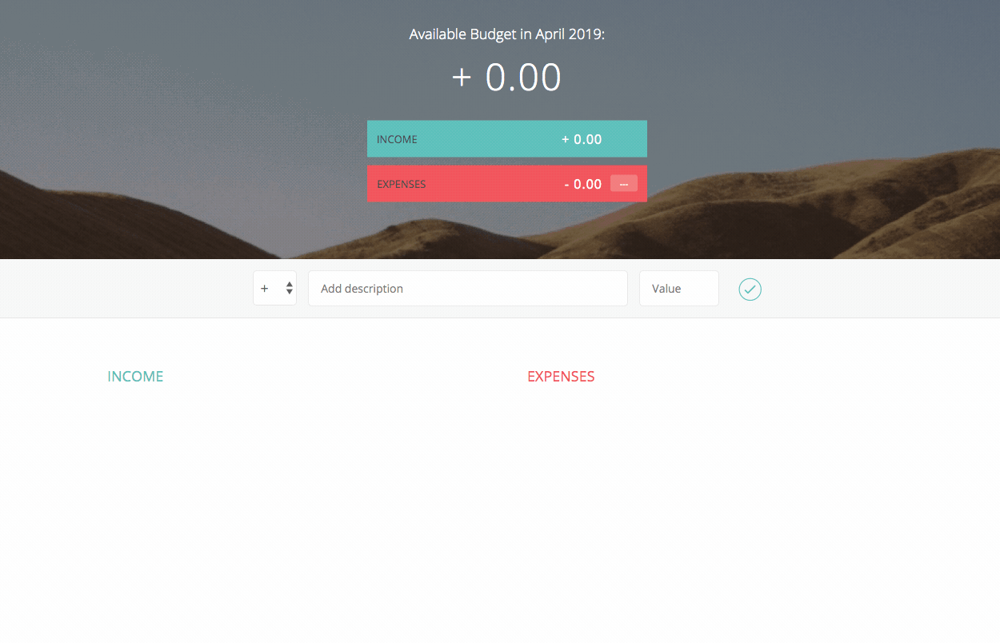

# 💰 Budget Tracking App

A simple and interactive **Budget Tracking Application** built with **HTML**, **CSS**, and **JavaScript** to help users manage their income and expenses. This app allows users to input transactions, track balances, and visualize their spending patterns in a user-friendly interface.

## 🖼️ Demo

## ✨ Features

- ✅ Add income and expense transactions
- ✅ Display current balance, total income, and total expenses
- ✅ Responsive and clean UI
- ✅ Data stored temporarily in memory (no backend required)

## 🛠️ Built With

- **HTML** - Page structure
- **CSS** - Styling and responsive layout
- **JavaScript** - Core logic and interactivity

